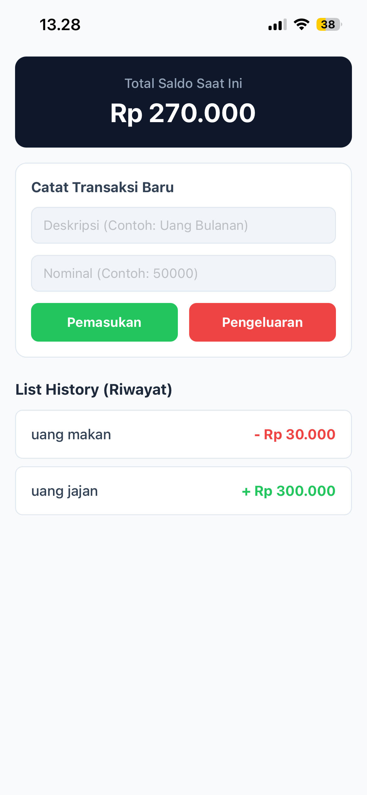
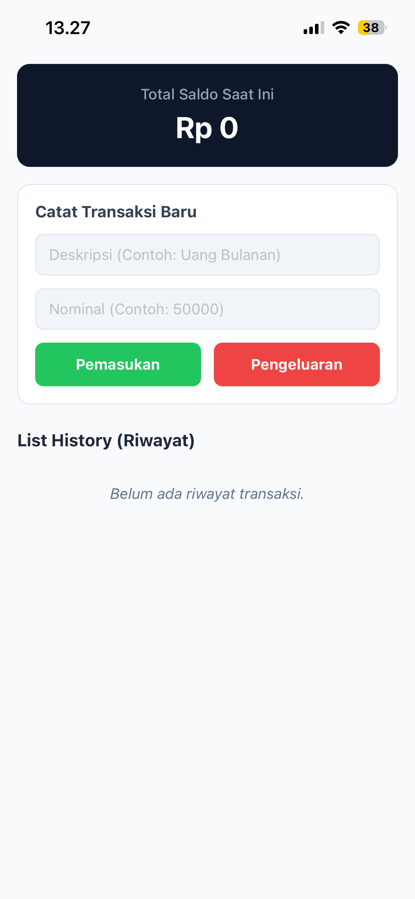

# DompetKu
Aplikasi pencatat keuangan pribadi berbasis mobile yang dibangun menggunakan **React Native** dan **Expo**. Aplikasi ini dirancang untuk membantu pengguna memantau pemasukan dan pengeluaran harian secara *real-time* guna menjaga stabilitas finansial.

## 📸 Preview Aplikasi (Screenshots)

| Tampilan Awal (Kosong) | Input Transaksi & Riwayat |
| --- | --- |
|  |  |

## 🚀 Fitur Utama

* **Dashboard Saldo Dinamis:** Menghitung total saldo secara otomatis (`Pemasukan - Pengeluaran`) dari Rp 0 secara *real-time*.
* **Form Input Terkontrol (Controlled Component):** Menerima input data Deskripsi (Teks) dan Nominal (Angka) secara valid dengan penanganan *numpad keyboard*.
* **Interactive List (`FlatList`):** Merender seluruh riwayat transaksi dengan performa tinggi dan hemat memori RAM.
* **Visual Feedback (Conditional Styling):** Nominal transaksi otomatis berwarna **HIJAU** untuk Pemasukan dan berwarna **MERAH** untuk Pengeluaran.
* **Empty State Handler:** Menampilkan pesan edukatif jika belum ada data transaksi yang tercatat.

---

## 🛠️ Kompetensi & Skill yang Diuji

Proyek ini mengimplementasikan konsep-konsep inti dalam pengembangan React Native:
1.  **State Management (Array Object):** Memanipulasi *state* array menggunakan prinsip *immutability* (Spread Operator `[...]`).
2.  **Input Handling:** Sinkronisasi dua arah antara komponen `TextInput` dengan *state* React.
3.  **Flexbox Layout:** Menyusun tata letak antarmuka yang responsif untuk berbagai ukuran layar HP menggunakan `flexDirection`, `justifyContent`, dan `alignItems`.
4.  **Array Reduce Logic:** Mengalkulasi total akumulasi saldo menggunakan metode bawaan JavaScript `.reduce()`.

---

## 📦 Cara Menjalankan Proyek di Lokal

### Prasyarat:
* Sudah memasang [Node.js](https://nodejs.org/) di laptop.
* Sudah memasang aplikasi **Expo Go** di HP Android atau iOS kamu.

2.  **Instal Dependensi:**
    ```bash
    npm install
    ```

3.  **Jalankan Server Pengembangan Expo:**
    ```bash
    npx expo start -c
    ```

4.  **Hubungkan ke HP:**
    * Buka aplikasi **Expo Go** di HP.
    * Scan **QR Code** yang muncul di terminal laptop kamu.
    * Pastikan laptop dan HP kamu terhubung ke jaringan **Wi-Fi yang sama**.

---
